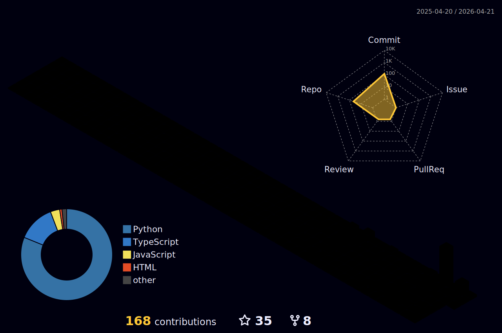

  

  

  
  
  

  
  
  
  
  

  
  
  
  
  
  
  
  
  
  

## Live Metrics

  
  
  
  

## Contribution Visuals

  

  <picture>
    <source media="(prefers-color-scheme: dark)" srcset="./profile-snake-contrib/github-snake-dark.svg" />
    <source media="(prefers-color-scheme: light)" srcset="./profile-snake-contrib/github-snake.svg" />
    
  </picture>

## Positioning

I build practical AI systems from **prototype to production**:

- Multi-agent engineering workflow and skills governance
- Content/media automation pipelines with delivery loops
- Productized developer tools with operational visibility
- Reliability-first delivery: reproducible scripts, maintainable architecture, and measurable outcomes

## Flagship Projects

| Project | Visual Card |
|---|---|
| [openfang-auto-clip](https://github.com/outhsics/openfang-auto-clip) |    |
| [ai-skills-control-kit](https://github.com/outhsics/ai-skills-control-kit) |    |
| [upload-test-file-generator](https://github.com/outhsics/upload-test-file-generator) |    |
| [ui-diff-tool](https://github.com/outhsics/ui-diff-tool) |    |
| [TrendRadar](https://github.com/outhsics/TrendRadar) |    |
| [react-schema-form-lite](https://github.com/outhsics/react-schema-form-lite) |    |

## Engineering Signal (2026-03-02)

- Repository portfolio normalized: **102 total**
- Archive-candidate backlog reduced to: **0**
- Current focus split: **31 active / 18 maintain / 4 incubating**
- Recruiter-facing repos now include consistent status narratives

## Stack

`TypeScript` `Node.js` `React` `Next.js` `Electron/Tauri` `Python` `Automation` `GitHub Actions` `AI Tooling`

## Open-Source Operating System

- [GitHub Brand Playbook](./GITHUB_BRAND_PLAYBOOK.md)
- [Project Index](./PROJECT_INDEX.md)
- [Open Source Ops Guide (EN)](./OPEN_SOURCE_OPERATIONS_GUIDE.en.md)
- [开源运营指南（中文）](./OPEN_SOURCE_OPERATIONS_GUIDE.zh-CN.md)
- [README Status Block Template](./templates/README_STATUS_BLOCK.md)
- [Repo Bootstrap Checklist](./templates/REPO_BOOTSTRAP_CHECKLIST.md)

## Contact

- GitHub: [@outhsics](https://github.com/outhsics)
- Email: `outhsics@gmail.com`
